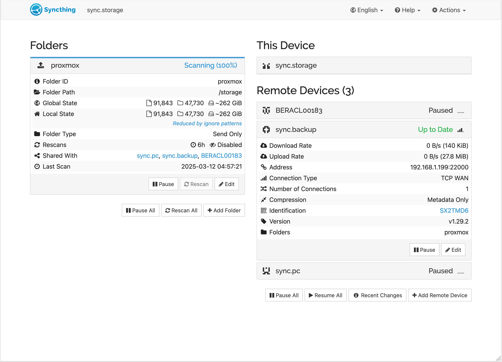

# DiwanSync - Private Cloud Blueprint


```
Diwān - دِيوَان is a central official registry with a collection of written records.
```

# At a Glance

- A free blueprint for a private personal server hosting photos and files.

- Automatic photo backup and sharing capabilities.

- Runs on cheap refurbished hardware and scales to enterprise systems if required.

- Securely accessible everywhere. Open source. 100% free.

### Demo

**Public**
- [File sharing demo](https://storage.alyudeen.mywire.org/share/P51zqRA8K_PZxDp-yKDLHw)
- [Photo sharing demo](https://immich.mahmoud.alyudeen.mywire.org/share/lbG8F_Ag2aipTvQkJQpvoLSe6KIqyTp0sCX8Gey5nhlDSHmHZTwqUhDmWT2qSZP8QfI)

**Private**
- See yourself get locked out trying to access https://storage.alyudeen.mywire.org/

# This Repository

This repository aims to document iterative changes for myself, and to be a guide to replicate the full setup or parts of it as easily as possible.

If you're looking to move away from relying on big tech companies to manage your files and photos, you're welcome to reach out. I'm happy to help!

Feel free to ask questions by filing an issue or starting a discussion. Pull requests for improvements are also always appreciated.

### New to server management?

Don't worry; we all started somewhere. Try parts of this setup on `Docker Desktop` on any computer before investing in hardware.

### Steps:

1. **Install Docker Desktop**: https://www.docker.com/products/docker-desktop
2. **Clone this Repository**:  
   Download the DiwanSync repository to your local machine.
3. **Try Docker Compose**:  
   Use the provided `docker-compose` configurations to run the services in containers.
4. **Access the Services**:  
   Follow the guides and instructions below to access services locally.

# Services

Each service provides a key function of the system; Services can be picked and customized to fit personal needs, with space for addition. Each service has its own active community that provides support for specific needs.

My example setup is split between 1 active "Main Node" that runs all the services, and one passive "Backup Node" to provide a backup for redundancy and disaster recovery. I plan to add a "Remote Node" later to add geographical destribution.

### Main Node

- `201-home`
  - Purpose: Control lights and smart devices from web and mobile apps.
  - Project: https://www.home-assistant.io
  - Link: https://home.alyudeen.mywire.org/
- `202-storage`
  - Purpose: Access and share files from a web browser
  - Project: https://github.com/gtsteffaniak/filebrowser
  - Link: https://storage.alyudeen.mywire.org/
- `203-nginx`
  - Purpose: Access services using pretty https URLs, with SSL certificate creation and management.
  - Project: https://github.com/NginxProxyManager/nginx-proxy-manager
  - Link: https://nginx.alyudeen.mywire.org/
- `204-ddns`
  - Purpose: Make the server remotely accessible by updating DDNS providers with realtime IP address.
  - Project: https://github.com/qdm12/ddns-updater
  - Link: https://ddns.alyudeen.mywire.org/
- `205-sync`
  - Purpose: Send files periodically to backup node for disaster recovery.
  - Project: https://github.com/syncthing/syncthing
  - Link: https://sync.storage.alyudeen.mywire.org/
- `206-homebackus`
  - Purpose: Enable home assistant backups over the network in files for disaster recovery.
  - Project: https://github.com/dperson/samba
  - Notes: A "full" backup automatically restores all configuration, automations, scenes, and device connections.
- `207-auth`
  - Purpose: Require 2 factor authentication to access services and enable passwordless login.
  - Project: https://github.com/goauthentik/authentik
  - Link: https://auth.alyudeen.mywire.org/
- `209-logs`
  - Purpose: Display access logs by country, ip, destination service, and other parameters.
  - Project: https://github.com/xavier-hernandez/goaccess-for-nginxproxymanager
  - Link: https://logs.alyudeen.mywire.org/
- `22#-immich`
  - Purpose: Automatic photo backup from phones, with web and client apps, and sharing and albums.
  - Project: https://github.com/immich-app/immich
  - Link: https://immich.mahmoud.alyudeen.mywire.org/

### Backup Node

- **Operating system**: Windows.
- **Hosted service**: Syncthing.
  - Purpose: Receive files periodically from `Main Node` for disaster recovery.
  - Installer runs automatically on windows boot: https://github.com/Bill-Stewart/SyncthingWindowsSetup
  - Link: https://sync.backup.alyudeen.mywire.org/

# Repository Structure

### [/machines](/machines)

Service service folders are cloned by the `Main Node` machine from this repository and distributed to `lxc` containers using `ProxmoxVE` mountpoints.

Each docker service is deployed on a separate `lxc` container using a dedicated docker compose file.

ℹ️ `201-home`: Only `Home Assistant Operating System` runs on a VM, not a container.

### [/config](/config)

`ProxmoxVE` uses `VMID.conf` files to store VM and container hardware configuration, mountpoints, and network configuration.

Config files are maintained by `ProxmoxVE` - under `/etc/pve/lxc`. They are copied over to this repository.

### [/utils](/utils)

Provided `symlinks` for easier navigation to relevent folders under the `ProxmoxVE` folder structure:
- Containers' `.conf` files: [/utils/lxcconf](/utils/lxcconf)
- Containers' mounts using `pct mount <vmid>` for maintainance: [/utils/lxcmounts](/utils/lxcmounts)
  - https://pve.proxmox.com/pve-docs/pct.1.html

# Notes

#### Proxmox Setup

`ProxmoxVE` runs services in isolation in separate virtual machines or lightweight linux containers with a GUI and easy backup / restore.

https://www.proxmox.com/en/

`ProxmoxVE` is installed on the main machine with 3 storage paths.

- `local`
  - The boot storage on which `ProxmoxVE` is installed.
  - Used to store all running VMs and containers.
- `storage`
  - A logically (or also physically) separate storage from `local` boot storage.
  - Needed for functionality of `202-storage` / `206-homebackups` / `20#-immich`.
  - Contains secrets for `203-nginx` / `204-ddns` / `206-homebackups` / `207-auth` / `20#-immich`.
  - The config files can be edited to remove or alter these requirement.
- `backup`
  - Network storage accessing another machine.
  - Needed for accessing backup files on `202-storage`.
 
Result: [images/proxmox-storage-configuration](images/proxmox-storage-configuration.png)

💡 The storage setup can be simplified for setup and testing, with only one configured storage path.

#### Service folder structure
- `docker-compose.yml`
- `.env` file (if needed)
- Config file (if needed)
- Example: [/machines/202-storage/](/machines/202-storage/)

#### Mountpoints

`ProxmoxVE` mountpoints "mount" / expose / inject folders from the host machine -> into folders in the hosted container. They are used here to distribute storage paths, service configuration files, secrets, and files created by the service.

Example: [202.conf](/config/202.conf)
  - `storage` mount `mp0: /mnt/pve/storage,mp=/mnt/storage`
  - `backup` mount: `mp1: /mnt/pve/backup,mp=/mnt/backup`
  - Service config mount: `mp2: /root/homelab/machines/202-storage,mp=/root/202`

Result: [images/202-files-folder-structure](images/202-files-folder-structure.png)

💡 This setup can be made simpler for private use by placing everything in the same folder.

#### Secrets, Environment Variables, and service files

Docker supports `.env` files to store environment variables to be used in `docker-compose.yml`. To avoid publicly exposing access tokens and secrets in this repository, they're stored in `storage` folders and accessed using `symlink` files.

Example: [207.conf](/config/207.conf)
- The real `.env` file with secrets is under `storage/containers/authentik`
- The service folder contains a `symlink` pointing to the real `.env` file - under [/machines/207-auth/.env](/machines/207-auth/.env)
- `ProxmoxVE` config mounts 2 folders - ℹ️ nested inside each other - under [/config/207.conf](/config/207.conf)
- `mp0: /root/homelab/machines/207-auth,mp=/root/207`
  - `mountpoint 0` mounts the service folder [/machines/207-auth/](/machines/207-auth/) to `/root/207` 
- `mp1: /mnt/pve/storage/containers/authentik,mp=/root/207/authentik`
  - `mountpoint 1` mounts the `storage` folder `/storage/containers/authentik` - ℹ️ inside -  `mountpoint 0`: [/machines/207-auth/](/machines/207-auth/)
 
Result: [images/207-auth-folder-structure](images/207-auth-folder-structure.png)

💡 This setup can be made simpler for private use by placing everything in the same folder.

#### Recommended terminal utilities

- GUI Git client:
  - https://github.com/jesseduffield/lazygit?tab=readme-ov-file#ubuntu
- GUI file manager:
  - https://github.com/MidnightCommander/mc
  - https://askubuntu.com/questions/1071392/how-can-i-install-midnight-commander-on-ubuntu-18-04-1

# Guides and tutorials

- `ProxmoxVE` installation: https://youtu.be/7OVaWaqO2aU
- Manual `lxc` creation: https://youtu.be/gHBSrENzeqk
- `ProxmoxVE` Helper scripts: https://youtu.be/kcpu4z5eSEU
- `201-home`: https://youtu.be/65Lhn90f3YI
- `203-nginx`: https://youtu.be/sRI4Xhyedw4
- `202-storage`: https://youtu.be/W2yZ5_sd9Hc
  - Notes: The config files use `filebrowser quantum`, a fork of `filebrowser`.
- `204-ddns` - DDNS explained: https://www.youtube.com/watch?v=rOLGvZagdC0
- `207-auth`: https://www.youtube.com/playlist?list=PLH73rprBo7vSkDq-hAuXOoXx2es-1ExOP
- `22#-immich`: https://immich.app/docs/overview/quick-start

# Architecture Diagram


# Example Setup

#### Main node

Dell OptiPlex 7050 - refurbished
- Intel i5 6600 3.30GHz + 16gb memory
- 256gb boot + 1tb storage 

#### Backup node

Dell OptiPlex 7050 - refurbished
- Intel i3 7100T 3.40GHz + 8gb memory
- 256gb boot + 1tb storage


### Screenshots

#### Phone

| Home Assistant | Immich / Auth |
|-------|-----------------------------------------|
|  |  |
|  |  |

#### Web





